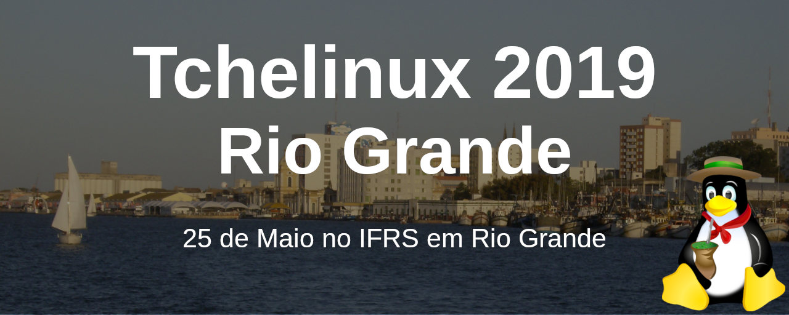

## Sobre

O grupo de usuários de Software Livre Tchelinux, em parceria com o [Instituto Federal de Educação, Ciência e Tecnologia do Rio Grande do Sul Campus Rio Grande](https://ifrs.edu.br/riogrande/), tem o prazer de convidar a comunidade para participar do evento que ocorrerá no dia **25 de Maio de 2019 a partir das 8:30h** no IFRS em Rio Grande.

## Inscrições

 O evento tem **entrada franca**, porém os participantes são encorajados a doar 2kg de alimentos não perecíveis (exceto sal), que são doados a instituições de caridade da região. Os alimentos são recebidos no momento do credenciamento.

<a href="https://forms.gle/gqwrcMivTLCKh8MF9" target="_blank"><b>Clique aqui para fazer sua inscrição!</b></a>

## Certificados

Serão fornecidos certificados digitais para os participantes do evento, que confirmaram sua presença. Para obtê-los, você deverá utilizar o email fornecido na sua inscrição para o evento.

**Importante:** Não esqueça de confirmar sua presença no credenciamento.

## Programação

| 
 Horário 
 | 
 Mini Auditório   Desenvolvimento 
 | 
 Sala 213   Big Data, IA, Web e DevOps 
 | 
 Anfiteatro   Segurança, Sysadmin e Comunidade 
 |
|:--------------------------:|:-----------------------:|:-----------------------:|:-----------------------:|
| **08:30** <td colspan=4>
**Credenciamento**
 |
| **09:00** <td colspan=4>
**Abertura**  Todo o público     Equipe Tchelinux    
 |
| **9:30** |  [**WebRTC - Comunicação aberta em tempo real**](#WebRTC_-_Comunicação_aberta_em_tempo_real)   Intermediário   Nelson Dutra Junior |  [**Explorando o mundo OpenSource com o Oracle VirtualBox**](#Explorando_o_mundo_OpenSource_com_o_Oracle_VirtualBox)   Principiante   Evandro Duarte de Arede Junior |  [**(In)segurança na Internet**](#Insegurança_na_Internet)   Principiante   Diego Luiz Silva da Costa | 
| **10:20** |  [**APIs, REST e RESTful: O que os programadores precisam saber? **](#APIs,_REST_e_RESTful:_O_que_os_programadores_precisam_saber?)   Intermediário   Marcos Echevarria |  [**Construindo um Data Warehouse**](#Construindo_um_Data_Warehouse)   Intermediário    Vítor Resing Plentz |  [**Explorando Editores de Texto Open Source**](#Explorando_Editores_de_Texto_Open_Source)   Principiante   Gabriel Prestes Ritta |
| **11:10** |  [**Desenvolvendo Jogos com PyGame**](#Desenvolvendo_Jogos_com_PyGame)   Principiante   Jerônimo Medina Madruga |  [**Análise da capacidade de cargas de um sistema logístico de uma empresa de Bento Gonçalves **](#Análise_da_capacidade_de_cargas_de_um_sistema_logístico_de_uma_empresa_de_Bento_Gonçalves)   Intermediário   Willian de Moura | [**Shell Script: Seu melhor amigo na automatização de instalações e configurações em ambientes Linux**](#Shell_Script:_Seu_melhor_amigo_na_automatização_de_instalações_e_configurações_em_ambientes_Linux)   Intermediário   Rafael Arvelos Martins Souza |
| **12:00** <td colspan=4>
**Intervalo para Almoço**
 |
| **13:30** |  [**Princípios e Aplicações de Mineração de Dados em Python**](#Princípios_e_Aplicações_de_Mineração_de_Dados_em_Python)   Intermediário   Evandro Duarte de Arede Junior |  [**Criando sua primeira API REST utilizando NodeJS, Express e MongoDB**](#Criando_sua_primeira_API_REST_utilizando_NodeJS,_Express_e_MongoDB)   Principiante   Robinson Luiz |  [**Do Zero ao YouTube em menos de 10 softwares livres**](#Do_Zero_ao_YouTube_em_menos_de_10_softwares_livres)   Principiante   Vinícius Alves Hax | 
| **14:20** |  [**Representation Learning - A “mágica” por trás de Deep Learning**](#Representation_Learning_-_A_“mágica”_por_trás_de_Deep_Learning)   Intermediário   Marco Birck |  [**O que é Ciência de Dados?**](#O_que_é_Ciência_de_Dados?)   Principiante   Lorenzo F. Antunes |  [**Desenvolvimento Web: O que fazer quando tudo der errado?**](#Desenvolvimento_Web:_O_que_fazer_quando_tudo_der_errado?)   Intermediário   Maicon Martins | 
| **15:10** <td colspan=4>
**Coffee-Break**
 |
| **15:40** |  [**Introdução à programação funcional com Clojure**](#Introdução_à_programação_funcional_com_Clojure)   Principiante   Victor Hechel Colares |  [**Criando um Chatbot com Node.js e Watson**](#Criando_um_Chatbot_com_Node.js_e_Watson)   Principiante   Lucas Venturella |  [**Bikeshedding**](#Bikeshedding)   Principiante   Márcio Josué Ramos Torres | 
| **16:30** |  [**Visualização de dados com o Superset**](#Visualização_de_dados_com_o_Superset)   Intermediário   Diego Novaes Bechtlufft |  [**Typescript - O Superset da linguagem javascript**](#Typescript_-_O_Superset_da_linguagem_javascript)   Intermediário   Robinson Luiz Acosta  |  [**Me formei. E agora?**](#Me_formei._E_agora?)   Principiante   Matheus Cezar | 
| **17:20** <td colspan=4>
**Encerramento**  Todo o público     Equipe Tchelinux    
 |

## Palestras

### WebRTC - Comunicação aberta em tempo real 
A maneira como realizamos chamadas de áudio e vídeo e compartilhamento P2P nos últimos anos mudou muito e tudo isso graças ao WebRTC. WebRTC é um projeto aberto que permite comunicação em tempo real ponto a ponto entre navegadores, dispositivos móveis e IoT através de uma simples API JavaScript. Nesta palestra entenda melhor o funcionamento desta API e tudo que ela nos permite fazer. 

### Nelson Dutra Junior 
[Nelson Dutra Junior](https://www.linkedin.com/in/dutrafox/) é Graduando em Engenharia de Computação pela UFPel, entusiasta de Software Livre, presidente na UFPel Rocket Team, foi voluntário na Comunidade Mozilla Brasil e atua como desenvolvedor Full Stack.

### APIs, REST e RESTful: O que os programadores precisam saber?  

A arquitetura das aplicações web vem mudando ao longo do tempo, não basta só sabermos fazer requests e esperarmos um json de retorno. Entender o conceito por trás das APIs e as vantagens do padrão RESTful farão toda a diferença na hora de desenvolver aplicações "elegantes". 

### Marcos Echevarria 

[Marcos Echevarria](https://twitter.com/quinhodev) é Marcos Echevarria é mestre em Ciência da Computação pela Universidade Católica de Pelotas. Desenvolve sistemas web há mais de 10 anos, tendo liderado equipes em projetos de médio e grande porte em empresas nacionais e internacionais. Atualmente é CEO na empresa Be Mobile e professor na Universidade Católica de Pelotas, onde leciona as disciplinas de Algoritmos e Engenharia de Software.

### Desenvolvendo Jogos com PyGame 

Jogar todo mundo joga. Programar, todo mundo pode. Jogar todo mundo treina. Programar, nem tanto. Mas para jogar é necessário que alguém desenvolva suas habilidades de programador. Nesse bate papo, porque ninguém mais tem paciência para palestras, será apresentada uma forma divertida de desenvolver a programação e conhecer a linguagem Python, construindo jogos, utilizando a biblioteca Pygame e ferramentas open source para desenvolver um jogo. 

### Jerônimo Medina Madruga 

[Jerônimo Medina Madruga](https://www.linkedin.com/in/jmmadruga/) trabalha com suporte técnico e treinamento para educação a distância da Universidade Federal de Pelotas (UFPel). Tem formação em Técnico em Eletrônica pelo Instituto Federal Sul-Rio-Grandense (IFSUL) e é ocasionalmente atuante em grupos ligados a divulgação e desenvolvimento de software livre. Já realizou mais de 70 palestras em eventos internacionais, nacionais e regionais, sobre os temas mais variados possíveis, normalmente ligados a educação, programação, comunidades, CMS e administração de sistemas. 

### Princípios e Aplicações de Mineração de Dados em Python 

Exploraremos conceitos fundamentais do processo de descoberta do conhecimento em mineração de dados, tais como formulação de hipóteses, pré-processamento, métodos de obtenção de informação (Associação, Clusterização, Classificação e Regressão) e um pouco sobre verificação e validação. Nisso, demonstraremos alguns exemplos práticos utilizando a linguagem Python unida às bibliotecas Scikit Learn, Pandas e Matplotlib, além do banco não relacional MongoDB, todas exemplos de softwares livres amplamente utilizados por cientistas de dados. 
### Evandro Duarte de Arede Junior 

[Evandro Duarte de Arede Junior](https://www.linkedin.com/in/evandro-junior-950907120) é formado em Engenharia de Computação pela FURG (2018) trabalha atualmente como programador.

### Representation Learning - A “mágica” por trás de Deep Learning 

Essa palestra procura explorar o conceito de representation learning, como ele está intrinsecamente ligado a machine learning e deep learning, além de permitir um entendimento mais lúdico de como os processos de aprendizado acontecem nos algoritmos de Machine Learning. 

### Marco Birck 
[Marco Birck](https://www.linkedin.com/in/mafbirck/) está no último semestre de Ciência da Computação na UFPel, é Cientista de Dados e Co-Fundador da Startup [Elixir AI](https://elixirai.com.br/), ajuda na organização de eventos relacionados à àrea de Data Science e Machine Learning como o [Pelotas Data Science Meetup](https://www.meetup.com/Pelotas-Data-Science-Meetup/). É membro do grupo de pesquisa DataLab UFPel, onde realiza e auxilia em diversas pesquisas nos assuntos de: Deep Learning, Reinforcement Learning, Meta-Learning, Transfer Learning, Computer Vision, etc.

### Introdução à programação funcional com Clojure 

Nesta palestra iremos abordar os princípios do pensamento funcional, qual a diferença dele com o imperativo e o que faz uma linguagem de programação ser funcional. Também veremos como dar os primeiros passos aplicando esse pensamento através do Clojure, vendo seus principais comandos, estratégias e maneiras de trabalhar. 

### Victor Hechel Colares 
[Victor Hechel Colares](https://www.linkedin.com/in/victor-colares-89a412170/) esta cursando o terceiro semestre do curso de Tecnologia em Análise e Desenvolvimento de Sistemas (TADS) no IFRS Câmpus Rio Grande e trabalha como desenvolvedor .NET. Em 2018 concluiu o Técnico em Informática para Internet integrado ao Ensino Médio, também no IFRS.

### Visualização de dados com o Superset 

Essa palestra visa apresentar a aplicação web opensource Superset, que ajuda o usuário a construir dashboards com gráficos complexos de maneira simples a partir de diversas fontes de dados. A apresentação vai dar uma base “histórica” sobre a ferramenta, passar pelo seu estado atual e depois mostrará o passo a passo de como construir um dashboard a partir de um CSV/SQL. 

### Diego Novaes Bechtlufft 

[Diego Novaes Bechtlufft](https://www.linkedin.com/in/diego-novaes-bechtlufft/) está no quinto semestre de Ciência da Computação na UFPEL, é Cientista de Dados da Startup [Elixir AI](https://elixirai.com.br/) e membro do grupo de pesquisa DataLab UFPel, onde realiza e colabora com pesquisas envolvendo Deep Learning. Participa e ajuda a organizar eventos da área de Data Science na região, como o [Pelotas Data Science Meetup](https://www.meetup.com/Pelotas-Data-Science-Meetup/).

### Explorando o mundo OpenSource com o Oracle VirtualBox

Nesta palestra introduziremos o Oracle VirtualBox, uma das principais aplicações para virtualização de ambientes no mundo de softwares OpenSource. Nisso, abordaremos a criação e configuração de uma VM, estruturação de Redes e a possibilidade de teste e emulação de algumas aplicações como distribuições Linux, Bancos de Dados, servidores de páginas web, etc.

### Evandro Duarte de Arede Junior

[Evandro Duarte de Arede Junior](https://www.linkedin.com/in/evandro-junior-950907120) é formado em Engenharia de Computação pela FURG (2018) trabalha atualmente como programador.

### Construindo um Data Warehouse

Visa introduzir conceitos básicos envolvidos na criação de um Data Warehouse. A palestra aborda desde o que é um data warehouse, até conceitos de modelagem utilizados na construção do mesmo. 

###  Vítor Resing Plentz 

[ Vítor Resing Plentz](https://www.linkedin.com/in/vítor-resing-plentz-438681101) está concluindo o curso de Ciência da Computação, já foi presidente da Hut8 (EJ da Computação na UFPel) e atualmente é fundador e Cientista de Dados na [Elixir AI](https://elixirai.com.br/), participando também como organizador da comunidade [Pelotas Data Science Meetup](https://www.meetup.com/Pelotas-Data-Science-Meetup/).

### Análise da capacidade de cargas de um sistema logístico de uma empresa de Bento Gonçalves  

No Rio Grande do Sul, cerca de 85,3% da movimentação de cargas é ocupado pelo transporte via modal rodoviário. A forte dependência pelo modal rodoviário foi evidenciada pela crise que ocorreu em 2015 que gerou deseconomias e impôs desafios na resolução de problemas relacionados a hipertrofia do setor. A logística de transporte é considerada uma atividade intermediaria dentro da cadeia produtiva, porém fundamental para a sobrevivência no mercado das empresas a qual presta serviço. A modelagem e simulação consiste na representação virtual da realidade gerando dados a fim de ajudar na resolução de problema complexos e custos. Sendo assim o projeto tem como objetivo analisar a capacidade de cargas de um sistema logístico de uma empresa de Bento Gonçalves com auxilio da lógica de programação. Estudos conjuntos entre empresas e prestadores de serviço de transporte podem ajudar na redução de custos logísticos e potencializar resultados.

### Willian de Moura 
[Willian de Moura](https://www.linkedin.com/in/willian-de-moura-a35296160/) é Acadêmico do Curso Superior em Tecnologia em Logística no Instituto Federal de Educação, Ciência e Tecnologia do Rio grande do Sul. Possui experiências profissionais nas áreas de seguro patrimonial e de frota, P&D de produto e logística de distribuição. Bolsista de projeto de gestão e logística premiado em evento cientifico. Atua como mediador e palestrante e desenvolve projeto profissional voltado ao transporte de cargas e Inteligencia Artificial (IA). 

### Criando sua primeira API REST utilizando NodeJS, Express e MongoDB

Nesta palestra criaremos uma API REST utilizando NodeJS como um ambiente de execução Javascript server-side. Também utilizaremos Express Middleware para criarmos nossas rotas e MongoDB como banco de dados NoSQL.

### Robinson Luiz

[Robison Luiz](https://br.linkedin.com/in/robinson-luiz-656a55164) é Desenvolvedor de Software na Compasso em Rio Grande.

### O que é Ciência de Dados? 

Esta palestra visa introduzir o tema de Ciência de Dados para um público maior, com a finalidade mostrar como Ciência de Dados funciona, quais são os papéis que o Cientista de Dados ocupa, quais suas principais atribuições, etc. Também mostrará algumas das ferramentas utilizadas e comentará como o mercado de ciência de dados está se desenvolvendo no Brasil. 

### Lorenzo F. Antunes 

[Lorenzo F. Antunes](https://www.linkedin.com/in/lorenzofantunes/) é Lorenzo está terminando a graduação em Ciência da Computação na UFPel, é um dos fundadores da [Elixir AI](https://elixirai.com.br), startup que realiza serviços e desenvolve produtos na área Ciência de Dados e Inteligência Artificial para empresas espalhadas pelo Brasil. Participa do movimento de Ciência de Dados de Pelotas, organizando o [Pelotas Data Science Meetup](https://www.meetup.com/Pelotas-Data-Science-Meetup/). Durante a graduação realizou pesquisas em diversas áreas de Inteligência Artificial (Social network analysis, Text classification, Entity Matching, etc). Também foi Diretor de Marketing na Hut 8, a empresa júnior da Computação da UFPel. Participou da organização de eventos como: FLISol, TcheLinux e CodeArena.

### Criando um Chatbot com Node.js e Watson 

A palestra apresentará a implementação de um chatbot para realização de pedidos e ao final disponibilizará um link a ser acessado por QRcode para os espectadores testarem a aplicação.

### Lucas Venturella 

[Lucas Venturella](https://www.linkedin.com/in/lucas-venturella-04341121/) é desenvolvedor de software a mais de 7 anos, com vasta experiencia em diversas linguagens e projetos. Estudo apresentações em público a 6 meses e farei uma palestra envolvente que manterá o publico fascinado e também os fará querer perseguir mais conhecimento relacionado a esse campo.

### Typescript - O Superset da linguagem javascript 

Veremos o TypeScript, um superset da linguagem JavaScript criado pela Microsoft para permitir a escrita de scripts com a utilização de tipagem estática, orientação a objetos, e facilitando a escrita de código com uma sintaxe de fácil entendimento.

### Robinson Luiz Acosta  

[Robinson Luiz Acosta ](https://github.com/robinsonLuiz) é estudante do TADS no IFRS e trabalha atualmente na área de microservicos e na área de inovações (LABS) da Compasso.

### Insegurança na Internet 

Estamos conectados cada vez mais, mas será que manter o padrão nos deixa seguros na internet? .... Nesta palestra, que foi tema que ministrei no 1º Simpósio Regional de Segurança Cibernética, realizado pela Marinha do Brasil. Irei de maneira simples comentar sobre os aspectos relacionados a nossa segurança digital em um mundo pós Edward Snowden. 

### Diego Luiz Silva da Costa 

[Diego Luiz Silva da Costa](https://www.linkedin.com/in/diegocosta82/) é o idealizador e mantenedor do Canal no YouTube Projeto Root, que nasceu, em maio de 2014, a partir de uma ideia sua ainda na graduação em Redes de Computadores, na Faculdade de Tecnologia SENAC Pelotas. O canal tem como propósito o ensino gratuito sobre Tecnologia, Software Livre, GNU-Linux, Redes de Computadores e Segurança da Informação.

### Explorando Editores de Texto Open Source 

O objetivo da palestra é apresentar a funcionalidade dos editores de texto open source(com foco em LibreOffice e OpenOffice) para usuários de software livre e para aqueles que desejam migrar para a iniciativa open source, demonstrando a ampla capacidade destes programas na produção de textos, como artigos, livros e trabalhos acadêmicos.

### Gabriel Prestes Ritta 

[Gabriel Prestes Ritta](https://www.facebook.com/GabrielRittaWriter/) é escritor e autor da série literária "Lendas de Um Mundo Perdido" e de artigos publicados em jornais. Além disso, é um entusiasta do software livre, principalmente no que tange a área da escrita e do Design. Possui experiência com ferramentas variadas, como LibreOffice Writer, Blender 3D, Gimp e Kdenlive. Atualmente, cursa o terceiro ano do ensino médio e pretende formar-se em áreas da ciência e tecnologia.

### Shell Script: Seu melhor amigo na automatização de instalações e configurações em ambientes Linux 

Esta palestra tem o objetivo de apresentar uma experiência prática de utilização de Shell Script para a automatização de instalações e configurações de softwares em ambientes Linux. O desenvolvimento de tal automatização se deu no contexto do projeto AVAPolos, projeto de desenvolvimento tecnológico financiado pela CAPES e desenvolvido no Centro de Ciências Computacionais da FURG. Espera-se que o compartilhamento desta experiência forneça aos ouvintes uma visão de como o uso de Shell Script pode oferecer reprodutibilidade, facilidade, robustez e velocidade na configuração de serviços e sistemas. 

### Rafael Arvelos Martins Souza 

[Rafael Arvelos Martins Souza](https://www.facebook.com/rsouzika) é Bolsista do projeto AVAPolos, onde trabalha na automatização da instalação e configuração da solução. É estudante do segundo ano de Engenharia de Automação na FURG. Interessado em infraestrutura de sistemas e redes, segurança da informação, Internet das Coisas e sistemas embarcados.

### Do Zero ao YouTube em menos de 10 softwares livres 

Em 2019 lancei um curso semi-presencial de "Introdução à administração de sistemas Linux". Praticamente todos os passos, desde gravação até edição foram feitos utilizando software livre. O objetivo da palestra é apresentar os bastidores da gravação do curso e ensinar as pessoas que assistirem a palestra a também criarem seus próprios vídeos utilizando software livre. 

### Vinícius Alves Hax 

[Vinícius Alves Hax](http://viniciusah.com.br) é formado em Engenharia de Computação pela FURG e trabalha atualmente como Analista de TI na reitoria do IFSul. Utiliza Linux há quase quinze anos e tem experiência em desenvolvimento web e como administrador de sistemas, sempre utilizando preferencialmente o sistema livre.

### Desenvolvimento Web: O que fazer quando tudo der errado?

Palestra sobre como tomar decisões durante a construção de um sistema WEB, contando histórias que ocorreram na prática com sistemas dos mais diferentes tamanhos, desde Site simples que só carregam conteúdo a uma estrutura integrada de um Internet Banking. O objetivo da palestra é compartilhar experiências que podem ser úteis para quem quer entregar qualquer sistema, com um foco totalmente direcionado para WEB.

### Maicon Martins

[Maicon Martins](https://www.linkedin.com/in/maiconmartinspmp/) atua pela RCA Digital produtora de sistemas do Grupo Digital Business, profissional trabalhando a 15 anos com desenvolvimento para WEB. Essa estrada teve início durante a formação como técnico em informática no IFRS (quando era CTI) com estágios em programação, realizando vários papéis até hoje conforme seguem em ordem cronológica em que o conhecimento foi adquirido: Programador PHP, Programador JS Avançado, Analista de Sistemas, Líder Técnico, Programador JAVA, Analista de Negócios, Gerente de Projetos, Programador .NET, Programador Angular, Arquiteto de Software e DevOPs. Durante essa trajetória profissional houve a graduação na UNISUL e a certificação PMP (Project Management Professional).

### Bikeshedding 

Nas aulas abrimos bastantes "parênteses". Não, não os de código, os de assuntos paralelos mesmo. BIKESHEDDING! Nesses pequenos desvios, fala-se da etimologia dos nomes, das metáforas e filosofias usadas na programação, de fun facts, de tretas no mundo das empresas e da vida dos tech superstars, de idiossincrasias da comunidade de desenvolvimento e tecnologia, enfim, uma miscelânea de assuntos curiosos, que nunca teriam uma disciplina para encaixá-los, mas que agora tem uma palestra de 50 min :) 

### Márcio Josué Ramos Torres 

[Márcio Josué Ramos Torres](https://www.linkedin.com/in/marcio-josue-ramos-torres/) "Eu nasci a dez mil anos atrás", comecei com Basic num CP500 da Prológica - não, não tinha mouse; sem Internet, se aprendia lendo livros e revistas técnicas, escrevendo códigos e fazendo experiências; desenvolvi aplicações comerciais em dBase e então Clipper, sobre a plataforma MS-DOS; joguei Prince of Persia, Wolfenstein e DOOM (o primeiro!) - se usava o DOS/4GW para usar a memória estendida; já montei meu computador - quando se "setava" a IRQ por jumpers; instalei redes com cabo coaxial e conectores BNC; eu vi a ascensão da interface gráfica - adeus caracteres em fósforo verde; instalei o Win95 - malditos 13 disquetes; tive um Kit Multimídia da Creative - e uma Voodoo da 3dfx; migrei sistemas de Clipper para VB e Delphi; usei a Internet quando só existia HTML com "meia dúzia" de tags -sem CSS ou JS; acompanhei a ascensão da Web; eu estava lá, no início do Linux, vi sua evolução e consolidação nos servidores web - junto com CGI, Perl, Apache, MySQL, PHP, etc; instalei o Conectiva e já compilei o Kernel; instalei programas no "muque" - sem apt-get ou "avançar, avançar, ..."; comecei com Java ainda na versão 1.3 - sem enums, generics, autoboxing, etc, e tive meu primero contato (confronto) com OO - adeus velhos hábitos procedimentais; observei a Googlificação - mas usei o Cadê e o AltaVista; eu também estava lá, no crescimento do e-commerce - e no estouro da bolha da Internet; tive minha passagem por .NET e por Java EE e seus "ecosistemas"; atualmente, leciono POO, Patterns e Web no IFRS de Rio Grande e percebo que, na tecnologia, a única constante é o relacionamento com as pessoas.

### Me formei. E agora? 

Palestra focada ao público mais jovem. Através de uma análise do mercado atual, o palestrante traça diferentes caminhos para um desenvolvedor que deseja iniciar a sua carreira. 

### Matheus Cezar 
[Matheus Cezar](https://www.linkedin.com/in/matheus-mendes-cezar-662905132/) é Técnico em Desenvolvimento de Software pelo IFRS - Campus Rio Grande e Analista de Sistemas formado pela mesma instituição. Já frequentou o mercado do desenvolvimento no estado do Rio Grande do Sul durante alguns anos. Hoje, Analista de TI na Prefeitura Municipal de Rio Grande.

## Local

> **IFRS Campus Rio Grande**
> Rua Engenheiro Alfredo Huck, 475
> Rio Grande - RS

	<iframe src="https://www.google.com/maps/embed?pb=!1m18!1m12!1m3!1d1421.9815459984493!2d-52.08966516281934!3d-32.04053638069747!2m3!1f0!2f0!3f0!3m2!1i1024!2i768!4f13.1!3m3!1m2!1s0x95119c6b6a4707b7%3A0x3c4512db3222f71a!2sR.+Eng.+Alfredo+Huck%2C+475+-+Centro%2C+Rio+Grande+-+RS%2C+96201-460!5e0!3m2!1sen!2sbr!4v1555037506875!5m2!1sen!2sbr" width="600" height="450" frameborder="0" style="border:0" allowfullscreen></iframe>

## Apoio

### Institucional

### Patrocínio

### Divulgação

